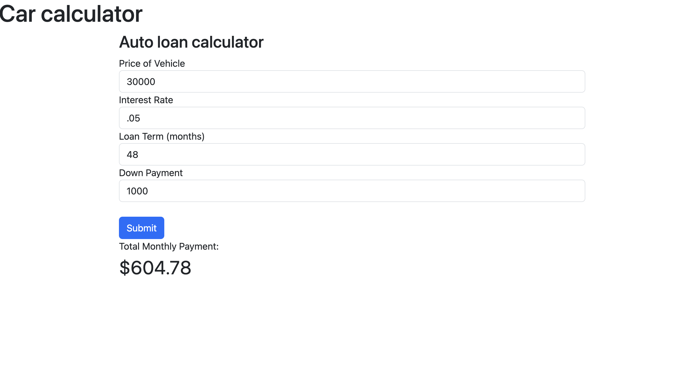

# MoCaFi Auto Loan Calculator 

<!-- PROJECT LOGO -->
 

    
 

<!-- ABOUT THE PROJECT -->
## About The Project

This project would allow the user to calculate what an auto loan might cost them. It is a prototype written in Javascript and deployed as a Firebase application.

### Built With

* HTML
* Javascript
* css
* Bootstrap

<!-- GETTING STARTED -->
## Getting Started

### Prerequisites

* Visual studio code
* npm
* firebase cli

### Installation

* git clone the code from github
* open in your browser

<!-- USAGE EXAMPLES -->
## Usage

* Navigate to [Firebase app](https://auto-loan-calculator-6c0a9.firebaseapp.com//)

This application will calculate the monthly payment when given the price of the car, the downpayment, interest rate, and the loan term.
## Roadmap

* Add number sliders 

<!-- CONTACT -->
## Contact

Tyson Cashaw - tyson.cashaw@mocafi.com

Project Link: [https://github.com/tysoncashaw/car-loan-calculator](https://github.com/tysoncashaw/car-loan-calculator)

<!-- ACKNOWLEDGMENTS -->
## Acknowledgments

* [CSS Tricks](https://css-tricks.com/animating-number-counters/)
* [Markdown Tutorial](https://docs.github.com/en/get-started/writing-on-github/getting-started-with-writing-and-formatting-on-github/basic-writing-and-formatting-syntax#links)
* [Firebase cli tutorial](https://firebase.google.com/docs/hosting/quickstart)

